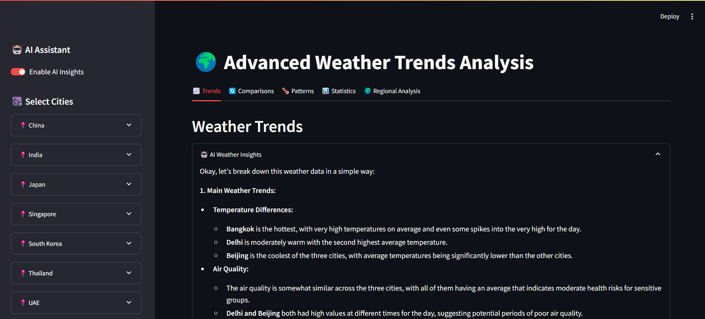
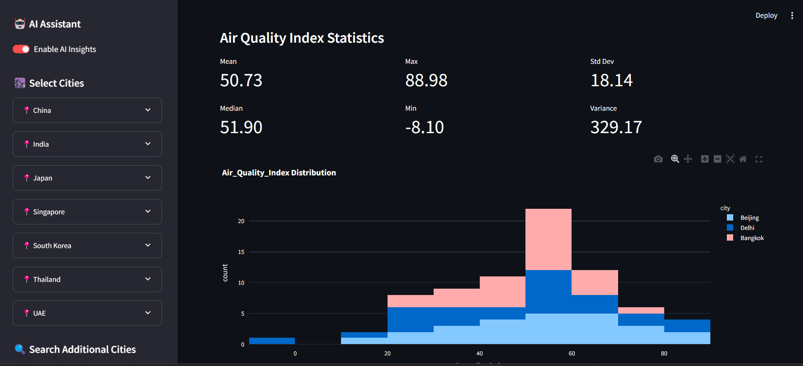

# 🌍 Advanced Weather Trends Analysis Dashboard

<div align="center">
  
[](https://www.python.org/)
[](https://streamlit.io/)
[](https://openweathermap.org/)
[](https://deepmind.google/technologies/gemini/)

<p align="center">
  
</p>

> A powerful, AI-enhanced weather analysis dashboard that brings climate data to life! 🌤️

</div>

---

## ✨ Features

### 🎯 Core Features
- **Multi-City Analysis**
  - 15+ pre-configured Asian cities
  - Global city search functionality
  - Group cities by country
  - Easy toggle selection

### 📊 Visualizations
- **Interactive Charts**
  - 📈 Line charts for temperature trends
  - 📊 Bar charts for rainfall comparison
  - 🌡️ Heat maps for temperature distribution
  - 🌪️ Wind rose diagrams
  - 📉 Distribution plots
  - 🗺️ 3D surface plots
  - 📈 Contour plots

### 🤖 AI-Powered Insights
- **Gemini-1.5-flash Integration**
  - Natural language explanations
  - Trend analysis
  - City comparisons
  - Weather pattern detection
  - Statistical interpretations
  - Regional analysis

### 📤 Data Export Options
- **Multiple Formats**
  - 📑 CSV reports
  - 📊 Excel spreadsheets
  - 📈 PNG/PDF visualizations
  - 📋 Summary statistics
  - 🖼️ SVG vector graphics

### 🎨 User Interface
- **Intuitive Design**
  - Sidebar city selection
  - Country-wise grouping
  - Search functionality
  - Interactive toggles
  - Expandable sections

---

## 🚀 Getting Started

### Prerequisites
```bash
Python 3.12+
OpenWeatherMap API key
Google Gemini API key
```

### Installation
1. **Clone the repository**
   ```bash
   git clone https://github.com/Saoud30/Weather-Trends-Analysis.git
   cd weather-trends-analysis
   ```

2. **Install dependencies**
   ```bash
   pip install -r requirements.txt
   ```

3. **Set up environment variables**
   Create a `.env` file:
   ```env
   OPENWEATHERMAP_API_KEY=your_api_key_here
   GEMINI_API_KEY=your_gemini_api_key_here
   ```

4. **Run the application**
   ```bash
   streamlit run app.py
   ```

---

## 🎮 Usage Guide

### 1. City Selection
- **Default Cities**
  - Expand country sections in sidebar
  - Toggle cities using checkboxes
  - All major Asian cities included

- **Search Additional Cities**
  - Use the search bar
  - Click on search results
  - Remove with ❌ button

### 2. Analysis Features
- **Time Range**
  - Select custom dates
  - Use preset ranges
  - Real-time updates

- **Parameters**
  - Temperature
  - Humidity
  - Wind Speed
  - Precipitation
  - Air Quality

### 3. AI Insights
- Toggle AI assistant
- Get natural language explanations
- View trend analysis
- Compare cities

### 4. Export Data
- Choose format (CSV/Excel/PDF)
- Select visualization type
- Download with one click

---

<div align="center">
  
</div>

<div align="center">
  
</div>

## 🛠️ Technologies Used

- **Frontend**
  - Streamlit
  - Plotly
  - Matplotlib
  - Seaborn

- **Backend**
  - Python
  - Pandas
  - NumPy
  - Requests

- **APIs**
  - OpenWeatherMap
  - Google Gemini-2.0-flash-exp

---

## 📝 Features in Detail

### Weather Parameters
- Temperature (°C/°F)
- Humidity (%)
- Wind Speed (km/h)
- Precipitation (mm)
- Air Quality Index
- Atmospheric Pressure
- Cloud Cover
- UV Index

### Analysis Types
- Historical Trends
- Real-time Monitoring
- Seasonal Patterns
- Climate Comparisons
- Regional Analysis
- Statistical Summaries

### Visualization Options
- Time Series Analysis
- Geographical Comparisons
- Distribution Analysis
- Correlation Studies
- Pattern Recognition
- Anomaly Detection

---

## 🤝 Contributing

Contributions are welcome! Please feel free to submit a Pull Request.

1. Fork the repository
2. Create your feature branch
3. Commit your changes
4. Push to the branch
5. Open a Pull Request

---

## 📄 License

This project is licensed under the MIT License - see the [LICENSE](LICENSE) file for details.

---

<div align="center">

### 🌟 Star us on GitHub — it helps!

[Report Bug](https://github.com/Saoud30/weather-trends-analysis/issues) · [Request Feature](https://github.com/Saoud30/weather-trends-analysis/issues)

</div>

---

<div align="center">
Made with ❤️ by Shazy
</div>
